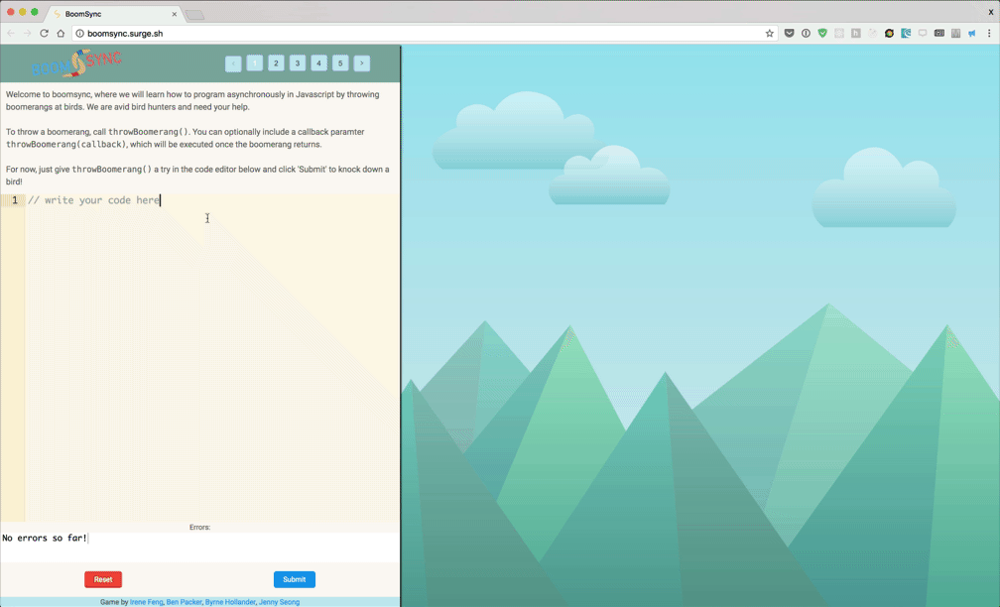

# BoomSync

A game to teach you asynchronous Javascript!

## How do I play?
Check it out at [http://boomsync.surge.sh/](http://boomsync.surge.sh/)!

## Support

Please [open an issue](https://github.com/irenelfeng/boomsync/issues/new) for support.

## Deploying
Call `npm run build` to build, and use [surge](https://surge.sh) to deploy.

`surge ./build`
Note that in order to support routers that use HTML5 pushState API, you may want to rename the index.html in your build folder to 200.html before deploying to Surge. This ensures that every URL falls back to that file.

## Contributing

Please contribute (add a level?) using [Github Flow](https://guides.github.com/introduction/flow/). Create a branch, add commits, and [open a pull request](https://github.com/irenelfeng/boomsync/compare/).
